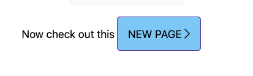
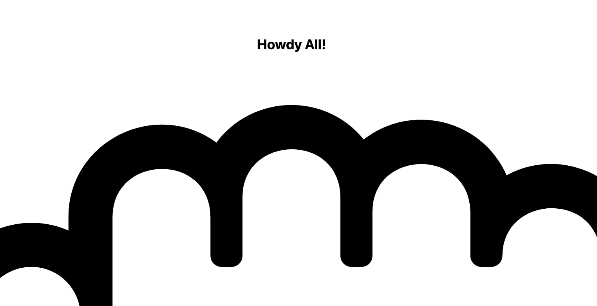
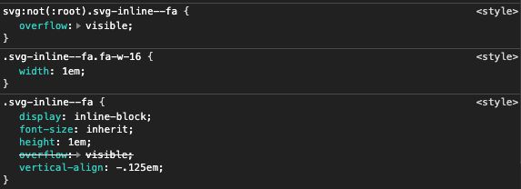

This is a [Next.js](https://nextjs.org/) project bootstrapped with [`create-next-app`](https://github.com/vercel/next.js/tree/canary/packages/create-next-app).

## Getting Started

First, run the development server:

```bash
npm run dev
# or
yarn dev
```

To build the site and launch in prod mode, run

```bash
npm run build
```

followed by

```bash
npm start
```

## Purpose

This project is a minimal example demonstrating an issue with the FontAwesome kit loader script. Launch the site from a prod build, and click the "New Page" link



You'll see the `fa-hand-rock` icon appears larger than it should, and inspecting it in Chrome DevTools shows that the FontAwesome minimal styling is not being applied



There should be some rules with selectors that look like



that come from a `<style/>` tag injected into the head of the document by the kit loader script. Inspecting the head shows that tag is missing after making the NextJS route transition.
